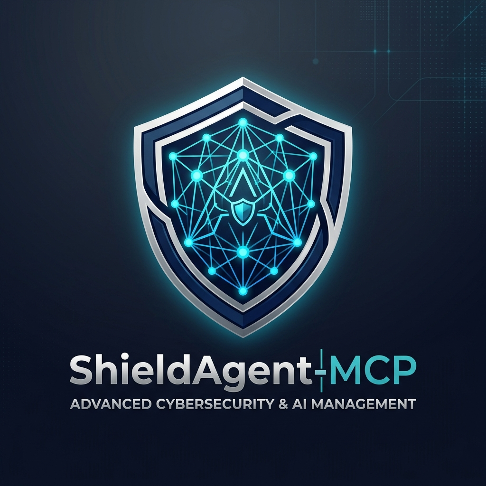

# ShieldAgent-MCP 🛡️🤖
### *The Hybrid-AI Security & Quality Sentinel for the MCP Era*



**ShieldAgent-MCP** is a cutting-edge security and code quality auditor designed for modern developer workflows. It combines the speed of local scanning with the intelligence of high-end LLMs to protect your codebase from PII leaks, secrets exposure, and architectural vulnerabilities.

---

## 🔥 Why ShieldAgent-MCP?

In an AI-native development world, security must be proactive and context-aware. ShieldAgent-MCP provides:

- **Local Sentinel (Privacy-First)**: High-speed scanning for API keys and PII that never leaves your machine.
- **Cloud Auditor (Deep Intelligence)**: Advanced architectural reviews and logic flaw detection powered by **Google Gemini 1.5 Pro**.
- **MCP Native**: Seamlessly integrates with AI assistants like Claude, Cursor, and ChatGPT.
- **Automated Gating**: Simple Git hooks to prevent security regressions before they are pushed.

---

## 🚀 Key Features

### 1. Dual-Layer Scanning
- **Local Layer**: Uses optimized Regex patterns to detect **AWS keys, OpenAI/Azure/Stripe secrets, GitHub PATs, Slack tokens, Google Cloud Service Accounts, JWTs, Private Keys, Emails, IP addresses, Credit Cards, and Phone Numbers**. 
- **Verification Layer (Local AI)**: Optional verification via **Ollama** (configurable model) to reduce false positives.
- **Intelligence Layer (Cloud AI)**: Deep analysis of code logic and security patterns using **Gemini 1.5 Pro**.

### 2. Model Context Protocol (MCP) Integration
Exposes standardized tools to your AI agent ecosystem:
- `scan_for_secrets`: Fast local scan for the current project. Now **asynchronous** and supports custom exclusions.
- `audit_file`: Deep architectural review of specific files using Gemini.
- `list_directory`: Explore project structure safely.
- `read_file`: Access file contents for deep analysis.
- `safe_write_file`: Remediation tool that applies patches with mandatory security justification and automatic backups.
- `check_network_exposure`: Audit local machine for risky listening ports and services.

### 3. Developer Experience
- **Beautiful CLI**: Powered by `rich` for aesthetic, actionable reports.
- **Git Hooks**: One-command installation for pre-push security gates.
- **Python-Native**: Easily extensible using Pydantic and Click.

---

## 🏗️ Installation

### Using `uv` (Recommended)
```bash
# Clone and install
git clone https://github.com/gbvk/shield-agent-mcp.git
cd shield-agent-mcp
uv sync

# Run directly
uv run shield-agent --help
```

### Using `pip`
```bash
pip install .
# Or with MCP support explicitly
pip install ".[mcp]"
```

---

## 🛠️ Usage

### 1. Local Security Scan
Scan a directory for potential leaks (Secrets, PII):
```bash
shield-agent scan --dir .
```
*Options:*
- `--ollama`: Use local AI verification (requires Ollama running).
- `--format json` or `--format jsonl`: Output results in structured format for automation.

### 2. Deep AI Audit
Analyze a specific file for logic flaws and security risks:
```bash
shield-agent audit path/to/file.py
```

### 3. Git Pre-Push Hook
Ensure security checks run before every push:
```bash
shield-agent install-hooks
```

### 4. Run MCP Server
Launch the server to connect with Claude Desktop or Cursor:
```bash
shield-agent run-mcp
```

---

## ⚙️ Configuration

ShieldAgent-MCP uses environment variables for sensitive configurations. Create a `.env` file in your project root:

```env
GEMINI_API_KEY=your_google_gemini_api_key_here
```

## 📄 Documentation & Architecture

For more details on how to build, configure, or extend ShieldAgent-MCP, please refer to the following guides:
- [Configuration Guide](docs/CONFIGURATION.md): Detailed configuration including Ollama integration.
- [Architecture Context](docs/CONTEXT.md): System design, dependencies, and internal flows.
- [Development Guide](docs/DEVELOPMENT.md): Best practices and workflows for contributing.

---

## 📄 License

This project is licensed under the MIT License - see the [LICENSE](LICENSE) file for details.

---

*Built with ❤️ for the AI-Native Developer by [gbvk312](https://github.com/gbvk312).*
